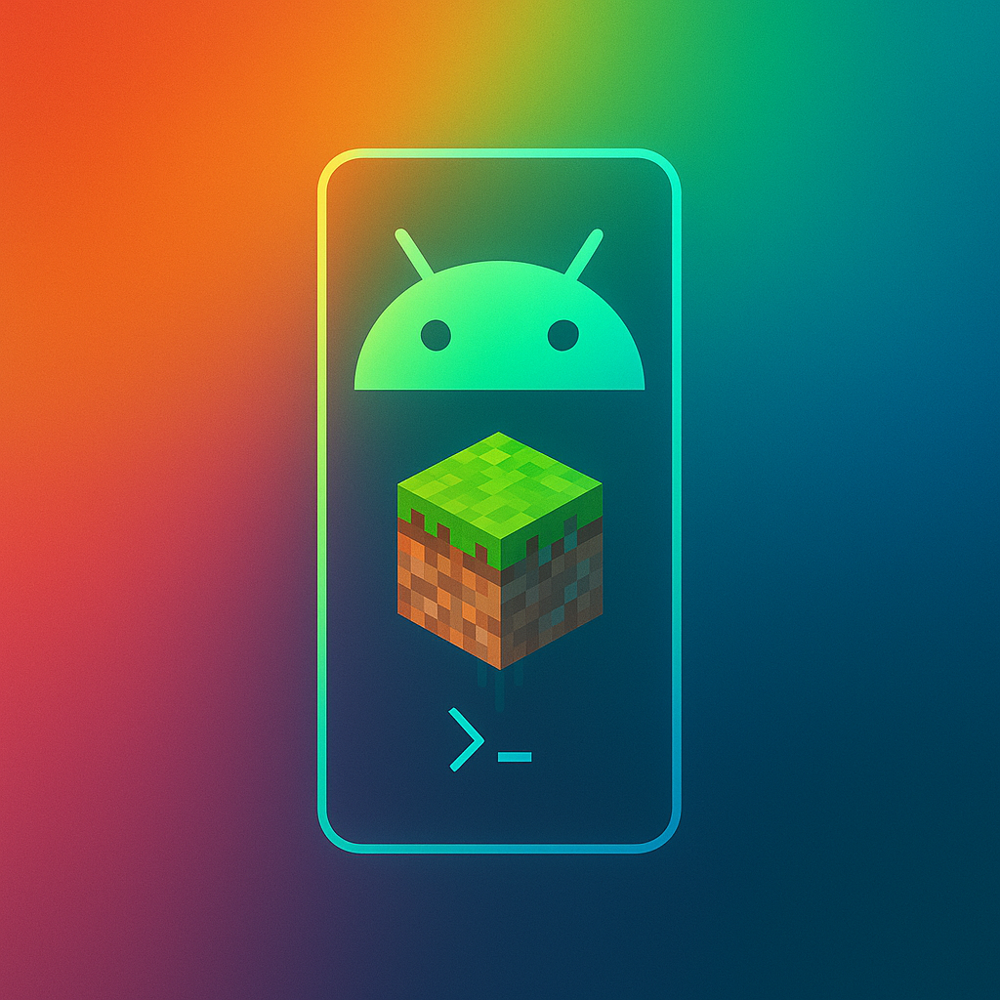

<div align="center">
  
  <h1 align="center">Bedrux</h1>
  <h3>Minecraft Bedrock Server on Android using Termux </h3>
</div>

---
> [!WARNING]
> This is my personal fork for personal use, i may not make it completely easy to understand step by step, i may not maintain the project or update it. ❗❗❗ DO NOT POST ISSUES ON THE OFFICIAL REPOSITORY❗❗❗

## 🚀 Features

- [x] Simple to use Bedrux Server Manager (SVM), to install, manage and backup server instances with ease.
- [x] Fetches the latest release or preview or any specified version of the Minecraft Bedrock server.
- [x] Downloads and validates the server files.
- [x] Backup and restore functionality for server instances.
- [x] Supports creating and replacing server instances.
- [x] AMD64 and AARCH64 support.

---

## ⚡ Getting Started

> [!IMPORTANT]
> To set up your Minecraft Bedrock Server, fist download [Termux](https://f-droid.org/de/packages/com.termux/). Once installed, launch Termux and allow it to finish initial setup. Then run the following command to initialize the Bedrux environment:
> 
> ```bash
> bash <(curl -s https://raw.githubusercontent.com/0Sombra666/bedrux/main/src/setup.sh)
> ```

### Starting your server
After setup is complete:
1. Enter the Debian environment with `sdeb`
2. Run `svm` to start the Bedrux Server Manager

---

## 💡 Important Notes

### ARM64 Compatibility
The Minecraft Bedrock Dedicated Server is not originally designed for ARM64 architecture, which is common in most Android phones. To make this work, we utilize [Box64](https://github.com/ptitSeb/box64) to translate the server from AMD64 to ARM64.

> [!WARNING]
> Although this translation works, be aware that the performance may be reduced, and some issues may arise. The server’s performance will vary heavily depending on your device’s specifications.

---

## 🌟 Why Bedrux?

Bedrux is an easy-to-use solution for running Minecraft Bedrock Dedicated Servers directly on your Android device, using Termux as the backbone. This saves you much work and time by installing everything that is needed for your Server hosting. Experience the fun of Minecraft without the need for a traditional PC or cloud hosting. You have full control of everything.

---

## 🌎 How i can play with my friends(cgnat method)?
1. Create a account in playit.gg
2. Configure your internal ip for server, something like "192.168.x.x:19132"
3. Enter in the debian environment using 'sdeb'
4. Install necessary packages
```txt
apt update && apt install wget curl -y && wget https://github.com/playit-cloud/playit-agent/releases/latest/download/playit-linux-aarch64 && chmod +x playit-linux-aarch64 && ./playit-linux-aarch64
```
5. Open the url that playit passed and test
6. Done, should worki
> [!WARNING]
> Start playitgg after fully starting the bedrock server to avoid server finder failures and instability
> Make to sure to put correct internal server to work
> This method is most recommended for users with cgnat

---

## 🌎 How i can play with my friends(direct method)?
1. Create a port forwarding in your local WiFi router
2. Make your ip static to avoid ip changes
3. Share your public ip to your friends and test it out with the port 19132

---

## 📚 Additional Resources

- [Termux Wiki](https://wiki.termux.com/wiki/Main_Page)
- [Box64 GitHub](https://github.com/ptitSeb/box64)
- [Minecraft Bedrock Dedicated Server](https://www.minecraft.net/de-de/download/server/bedrock)

---
